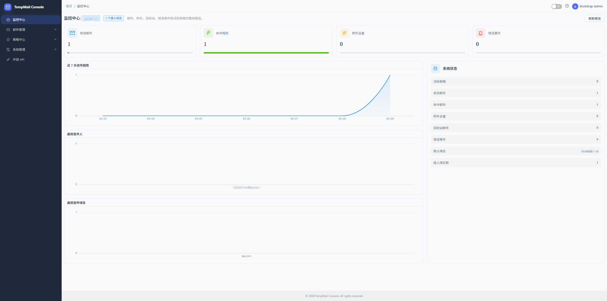
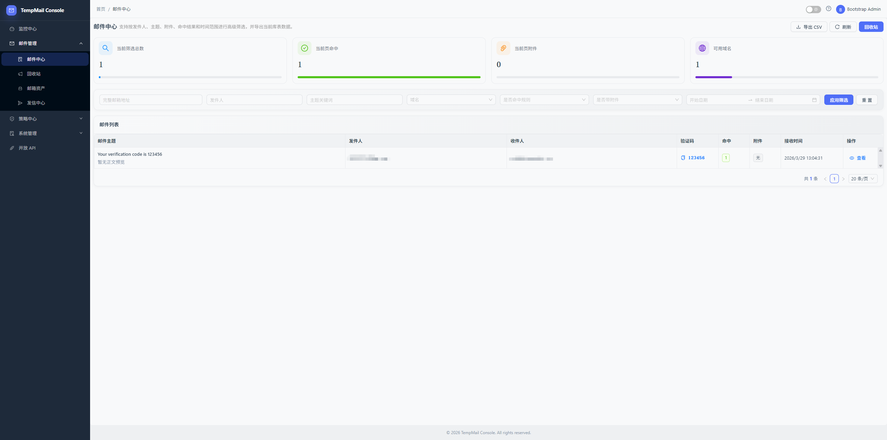
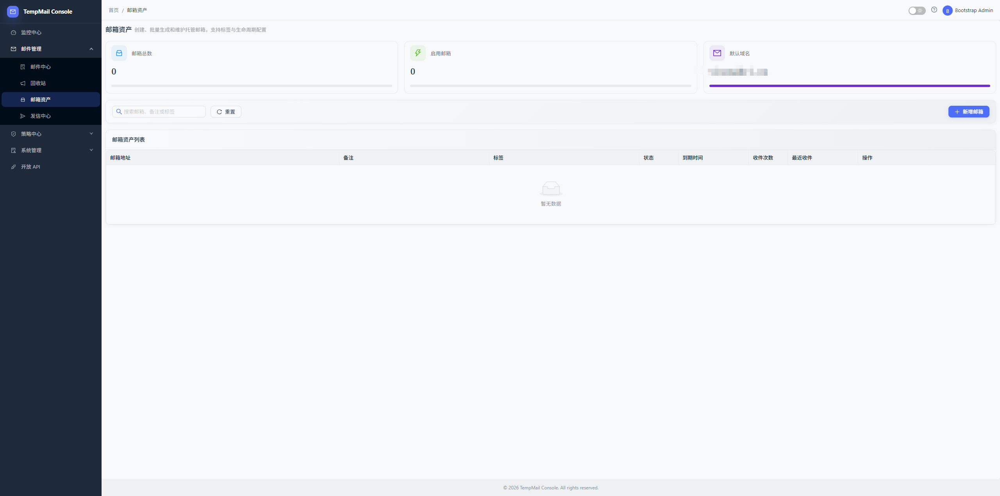
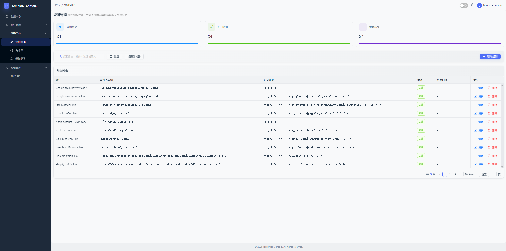
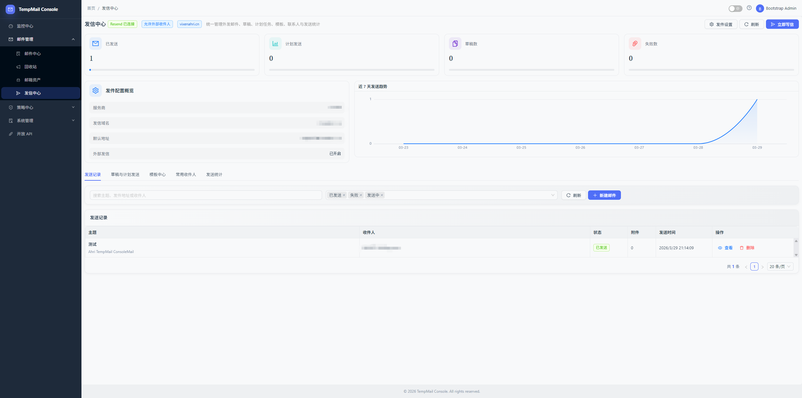
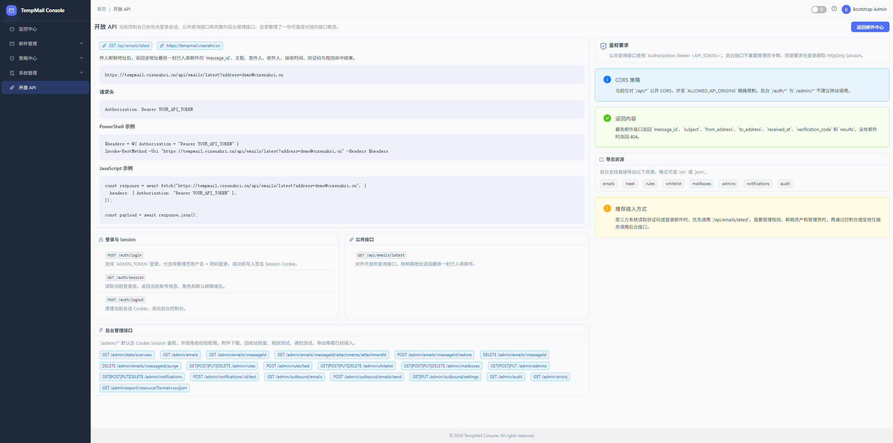
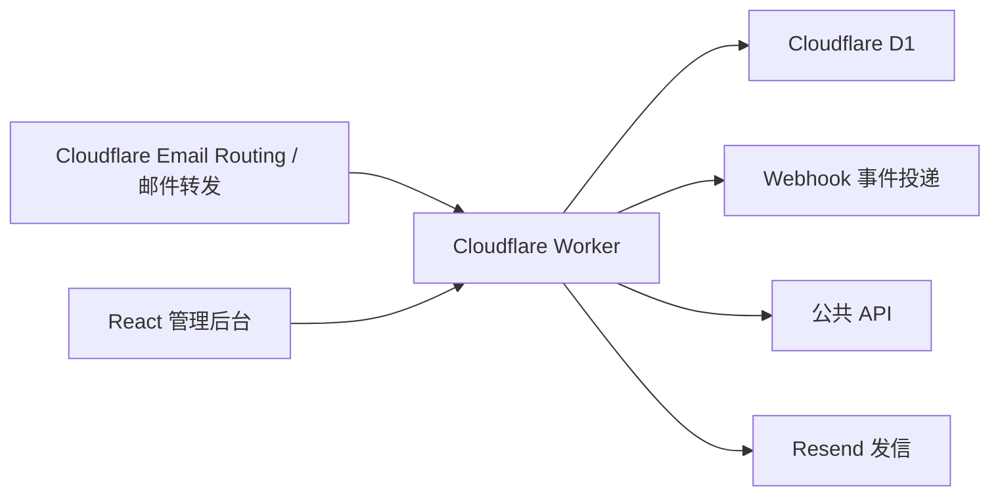

# TestMail Hub

> 面向测试团队、自动化团队和私有部署场景的邮件接收、验证码提取与邮箱资产治理控制台。

`Cloudflare Workers` `D1` `React 19` `TypeScript` `Ant Design` `GitHub Actions`

TestMail Hub 不是面向大众的“临时邮箱站”，而是一套更偏企业内部使用的邮件验证与治理后台。它把收件、提取、规则、白名单、项目隔离、Webhook、API Token、生命周期策略、域名资产和发信中心整合到了一套控制台里，适合做团队测试邮箱与验证码中台。

## 项目定位

推荐对外口径：

- 团队测试邮箱与验证码中台
- 私有部署邮件资产管理后台
- 自动化测试邮件平台

## 为什么做这个项目

很多团队都遇到过同一类问题：

- 自动化测试需要稳定接收注册、登录、验证、重置邮件
- 验证码和登录链接散落在邮箱里，人工找很慢
- 多项目、多环境测试流量混在一起，无法隔离
- 邮箱、域名、路由、Webhook、Token 缺少统一治理入口
- 私有部署和审计留痕要求越来越高

TestMail Hub 的目标就是把这条链路收成一个可持续演进的平台：

`接收邮件 -> 提取验证码/链接 -> 管理邮箱资产 -> 自动化接入 -> 团队治理与审计`

## 适用场景

- 自动化测试统一接收注册、登录、验证邮件
- QA 团队批量管理测试邮箱和验证码流程
- 多项目、多环境隔离邮件资产与通知事件
- 用 API / Webhook 接入测试平台、CI 或内部系统
- 私有部署团队搭建自己的测试邮件与验证码中台

## 当前状态

### 已经落地

- 邮件接收、正文存储、附件元数据与详情查看
- 验证码、登录链接、魔法链接、平台邮件识别
- 规则中心、白名单、全局白名单开关
- 多域名资产中心第一版
- 项目 / 环境 / 邮箱池三层隔离
- Project-scoped API Token / Webhook
- 生命周期策略中心与执行记录
- 成员中心、审计日志、系统错误日志
- Resend 发信中心、模板、联系人、发送记录
- GitHub Actions + Cloudflare Workers 持续部署链路

### 还在继续增强

- 验证码 / 链接提取准确率
- 更细的资源级权限与团队治理
- 更完整的多域名 provider 和域名治理规则
- 生命周期归档、保留审计与更细粒度清理动作
- 发信审批、队列化和更强的运维能力

更细的阶段实现状态见：

- [docs/计划书实现对照表.md](docs/计划书实现对照表.md)

## 文档导航

- [docs/README.md](docs/README.md)
  - 文档总览与建议阅读顺序
- [docs/CI-CD.md](docs/CI-CD.md)
  - GitHub Actions、远程迁移、Worker 发布与部署排障
- [docs/GITHUB-SECRETS.md](docs/GITHUB-SECRETS.md)
  - Deploy 工作流依赖的 Secrets 清单
- [docs/ARCHITECTURE.md](docs/ARCHITECTURE.md)
  - 当前代码结构、请求流、模块边界与二开建议
- [docs/CLOUDFLARE-MULTI-ACCOUNT.md](docs/CLOUDFLARE-MULTI-ACCOUNT.md)
  - 多 Cloudflare 账号下的域名治理与集中收件方案
- [docs/计划书实现对照表.md](docs/计划书实现对照表.md)
  - 当前真实实现状态，适合对外口径
- [docs/GITHUB-RELEASE-NOTES.md](docs/GITHUB-RELEASE-NOTES.md)
  - 上传仓库、写 PR 和写 Release 可直接复用的模板
- [docs/产品与研发计划书.md](docs/产品与研发计划书.md)
  - 原始阶段规划与路线图

## 核心能力

### 1. 邮件接收与查看

- 完整存储邮件正文、头信息和附件元数据
- 邮件详情页查看正文、规则命中、提取结果和附件
- 支持删除、恢复、彻底删除、备注、标签和回收站
- 列表直接展示验证码，并支持点击复制

### 2. 验证码 / 链接提取

- 提取常见数字验证码和数字字母混合验证码
- 提取验证链接、登录链接、魔法链接、重置链接、邀请链接
- 识别 GitHub、Google、Apple、PayPal、Steam、Discord、Microsoft、Amazon、Notion、Slack、OpenAI 等常见平台邮件
- API 与 Webhook 可直接返回提取结果

### 3. 规则与白名单

- 规则 CRUD 与规则测试器
- 白名单 CRUD
- 全局白名单开关
- 常见平台识别规则增强

### 4. 邮箱资产与多域名

- 邮箱生成、启停、批量创建、到期控制
- Cloudflare Email Routing 路由同步
- 多域名资产录入与管理
- 同一工作空间下支持根域名、子域名、二级及更深子域名分组展示
- 同账号多域名可复用全局 Cloudflare Token，也支持域名级独立 Token
- 支持域名级“邮箱路由转发到”，适合多 CF 账号集中收件
- 域名与项目 / 环境绑定
- 按工作空间过滤域名池与默认域名
- 路由策略支持“域名直配优先，否则继承 routing profile”
- Catch-all 策略管理与同步
- Catch-all 漂移、邮箱路由漂移观测与批量修复
- 域名维度监控卡片、排行图表、接入概览

### 5. 项目 / 环境隔离

- 项目、环境、邮箱池三层模型
- 邮件、邮箱、域名、Webhook、API Token 支持项目范围
- 项目级管理员绑定
- 工作空间目录接口与后台管理页面

### 6. 生命周期策略

- retention 策略表与默认全局策略
- 支持全局、项目、环境、邮箱池四级作用域继承
- 新建邮箱可按策略自动补默认过期时间
- 定时任务按策略清理普通邮件和已删除邮件
- 手动执行支持按动作类型单独触发（停用过期邮箱 / 自动归档 / 清理普通邮件 / 清理已删邮件）
- 后台可视化生命周期策略中心
- 定时任务执行记录与失败留痕

### 7. 管理与治理

- 管理员登录与 Session
- Bootstrap Token 登录
- 管理员、项目绑定、访问范围控制
- 成员中心支持关键词、角色、访问范围、项目、状态后端真筛选
- 成员备注、最近变更摘要与成员页内最近变更记录
- 审计日志支持按关键词、实体类型、动作域做服务端筛选
- 系统错误日志中心

### 8. API 与自动化

- 托管 API Token
- Token 权限拆分
- Project-scoped API Token
- 已提供公共 API：
  - `GET /api/emails/latest`
  - `GET /api/emails/latest/extraction`
  - `GET /api/emails/code`
  - `GET /api/emails/:messageId`
  - `GET /api/emails/:messageId/extractions`
  - `GET /api/emails/:messageId/attachments/:attachmentId`

### 9. Webhook

- 邮件接收、命中、验证码提取、链接提取等事件推送
- Secret 签名
- 投递记录、自动重试、手动重放
- 死信治理、单条/批量重放、单条/批量忽略
- 端点级告警规则：死信、重试、成功率、静默时长
- Project-scoped Webhook

### 10. 发信中心

- Resend 接入
- 发信设置可视化管理
- 草稿、立即发送、计划发送
- 发信记录、发送统计
- 模板管理、联系人管理
- 外部收件人开关

## 页面预览

| 监控中心                        | 邮件中心                       |
| ------------------------------- | ------------------------------ |
|  |  |

| 邮箱资产                          | 规则中心                      |
| --------------------------------- | ----------------------------- |
|  |  |

| 发信中心                         | API 文档                    |
| -------------------------------- | --------------------------- |
|  |  |

## 架构概览



如果你准备接手维护、继续拆模块或做二开，建议继续读：

- [docs/ARCHITECTURE.md](docs/ARCHITECTURE.md)

## 核心运行链路

### 1. 收件链路

`Cloudflare Email Routing -> Worker -> 邮件解析 / 提取 -> D1 -> Webhook / 后台 / 公共 API`

### 2. 后台请求链路

`React 页面 -> src/client/api/* -> src/index.ts -> src/handlers/* -> src/core/* -> D1 / 外部服务`

### 3. 定时任务链路

`Cron / Worker 调度 -> 生命周期清理 / Webhook 重试 / 发信队列 -> 审计与运行记录`

## 技术栈

- Runtime: Cloudflare Workers
- Database: Cloudflare D1
- Frontend: React 19 + Vite 7 + TypeScript 5
- UI: Ant Design 5 + ECharts
- Mail Parse: `postal-mime`
- Outbound: Resend
- CI/CD: GitHub Actions + Wrangler

## 多 Cloudflare 账号说明

项目现在支持“一套后台管理多个 Cloudflare 账号下的域名路由配置”，但这里有两个很重要的边界：

- 只能管理你自己有权限的账号 / 域名，不能越权控制第三方 Cloudflare 账号
- Cloudflare Email Routing 不能直接把别的账号下的域名投递到你账号里的 Worker

当前推荐做法：

- 同账号多域名：继续共用全局 `CLOUDFLARE_API_TOKEN`
- 多账号统一治理：为每个域名单独填写 `Token + Zone ID`
- 多账号集中收件：在非主账号域名上使用 `forward` 转发到主账号中继地址，并在域名资产里填写“邮箱路由转发到”

更完整的部署方案见：

- [docs/CLOUDFLARE-MULTI-ACCOUNT.md](./docs/CLOUDFLARE-MULTI-ACCOUNT.md)

## 域名资产中心速览

当前域名资产中心可以把“域名配置”“Cloudflare 实际状态”“治理动作”放到同一个页面里看，建议按下面三层理解：

### 1. 域名层级

- 同一个 worker 下可以录入多个域名，也可以录入这些域名下面的子域名
- 页面会按“最近的已注册父域名”自动归组，展示根域名、父域名、直接子域名和全部后代数量
- 这只是管理视角上的层级关系，不会把多个域名的治理规则强行合并
- 每个域名和子域名仍然保持独立资产，可单独绑定工作空间、服务商配置、Catch-all 策略和同步开关

### 2. Catch-all 生效规则

- 如果域名自己配置了 Catch-all，优先使用域名直配
- 如果域名设置为继承，且绑定的 routing profile 已启用并配置了 Catch-all，就继承 routing profile
- 如果两边都没有托管策略，就视为“继承现状”，系统只观测 Cloudflare 当前状态，不主动改写

### 3. 什么叫“漂移”

- `Catch-all 漂移`：本地生效后的 Catch-all 策略，和 Cloudflare 当前实际 Catch-all 状态不一致
- `邮箱路由漂移`：系统预期应该存在的邮箱路由，和 Cloudflare 当前已启用路由不一致
- 如果治理规则、域名状态和服务商能力都允许，页面会把这类差异标成“可修复”，支持单条或批量修复
- 如果当前配置只允许观测、不允许自动改写，则会显示为“治理受阻”

## 项目结构

```text
.
├─ src/
│  ├─ client/                    React 管理后台
│  │  ├─ api/                    前端接口封装
│  │  ├─ components/             通用组件与布局
│  │  ├─ hooks/                  通用交互逻辑
│  │  └─ pages/<feature>/        按功能拆分的页面目录
│  ├─ core/                      核心业务逻辑
│  │  ├─ db.ts                   数据访问聚合出口
│  │  ├─ db-*.ts                 分模块数据库实现
│  │  ├─ auth.ts                 Session / Token 鉴权
│  │  ├─ mailbox-sync.ts         Cloudflare 域名与路由同步
│  │  ├─ notifications.ts        Webhook 投递与重试
│  │  └─ outbound-service.ts     发信队列处理
│  ├─ handlers/                  Worker 路由处理层
│  │  ├─ handlers.ts             统一路由出口聚合
│  │  ├─ <feature>/              按功能域拆分的 handler
│  │  ├─ access-control.ts       权限边界判断
│  │  └─ validation/             参数校验模块目录
│  ├─ server/                    前后端共享类型
│  ├─ shared/                    provider / 共享定义
│  ├─ utils/                     常量与工具函数
│  └─ index.ts                   Worker 入口
├─ migrations/        D1 迁移脚本
├─ docs/              部署、Secrets、计划书等文档
├─ images/            README 截图
├─ test/              单元测试与 E2E
├─ Dockerfile
├─ docker-compose.yml
├─ wrangler.toml
└─ package.json
```

补充说明：

- `src/handlers/validation.ts` 现在是兼容出口，实际校验实现已拆到 `src/handlers/validation/*.ts`
- `src/core/db.ts` 现在主要负责统一导出和跨域查询，具体 SQL 已逐步下沉到 `src/core/db-*.ts`
- 前端页面基本按 `pages/<feature>/` 组织，页面自己的抽屉、列定义、指标卡和工具函数尽量就近放置

更详细的工程说明见：

- [docs/ARCHITECTURE.md](docs/ARCHITECTURE.md)

## 本地快速开始

### 环境要求

- Node.js 20+
- npm 10+
- Cloudflare 账号
- Resend 账号，可选，仅发信中心需要
- Docker / Docker Compose，可选，仅本地容器运行时需要

### 1. 安装依赖

```bash
npm install
```

### 2. 准备本地环境变量

```bash
cp .dev.vars.example .dev.vars
```

Windows PowerShell 也可以直接用：

```powershell
Copy-Item .dev.vars.example .dev.vars
```

至少填好这些值：

- `ADMIN_TOKEN`
- `API_TOKEN`
- `SESSION_SECRET`
- `MAILBOX_DOMAIN`

如果你要本地调试 Cloudflare 路由同步，还需要：

- `CLOUDFLARE_API_TOKEN`
- `CLOUDFLARE_ZONE_ID`
- `CLOUDFLARE_EMAIL_WORKER`

如果你要调试发信中心，还需要：

- `RESEND_API_KEY`
- `RESEND_FROM_DOMAIN`
- `RESEND_DEFAULT_FROM`

### 3. 初始化本地 D1

```bash
npm run db:migrate:local
```

### 4. 启动开发环境

```bash
npm run dev
```

默认访问：

```text
http://127.0.0.1:4173
```

### 5. 常用命令

```bash
npm run typecheck
npm test
npm run build
npm run check
```

如果本机已经装了 Chrome，想直接跑登录冒烟：

```bash
npx playwright test test/e2e/login.spec.ts -c playwright.local.config.ts
```

## 核心环境变量

| 变量名                     | 建议级别            | 说明                                |
| -------------------------- | ------------------- | ----------------------------------- |
| `ADMIN_TOKEN`              | 必填                | Bootstrap 管理员登录令牌            |
| `API_TOKEN`                | 必填                | 全局公共 API 令牌                   |
| `SESSION_SECRET`           | 必填                | 后台 Session 签名密钥               |
| `MAILBOX_DOMAIN`           | 强烈建议            | 默认邮箱域名，也是回退主域名        |
| `FORWARD_TO`               | 可选                | 原始邮件转发地址                    |
| `ALLOWED_API_ORIGINS`      | 可选                | 允许跨域访问 `/api/*` 的浏览器源    |
| `ERROR_WEBHOOK_URL`        | 可选                | 错误事件回调地址                    |
| `CLOUDFLARE_API_TOKEN`     | 路由同步 / 部署需要 | Cloudflare API Token                |
| `CLOUDFLARE_ZONE_ID`       | 路由同步需要        | 默认主域名对应 Zone ID              |
| `CLOUDFLARE_EMAIL_WORKER`  | 路由同步建议        | Email Routing 指向的 Worker 名称    |
| `CLOUDFLARE_ACCOUNT_ID`    | CI/CD 建议          | GitHub Actions / Docker deploy 使用 |
| `RESEND_API_KEY`           | 发信需要            | Resend API Key                      |
| `RESEND_FROM_DOMAIN`       | 发信需要            | 已验证的发件域名                    |
| `RESEND_DEFAULT_FROM_NAME` | 发信建议            | 默认发件人名称                      |
| `RESEND_DEFAULT_FROM`      | 发信建议            | 默认发件地址                        |
| `RESEND_DEFAULT_REPLY_TO`  | 可选                | 默认 Reply-To                       |

完整示例见 [.dev.vars.example](.dev.vars.example)。

## 登录方式

当前支持两种登录方式：

- 使用 `ADMIN_TOKEN` 进行 Bootstrap 登录
- 创建正式管理员账号后，使用用户名 + 密码登录

推荐做法：

1. 首次部署后先用 `ADMIN_TOKEN` 登录。
2. 进入后台创建正式管理员。
3. 后续主要使用正式管理员账号。
4. 保留 `ADMIN_TOKEN` 作为应急入口，不对外公开。

## 公共 API 快速示例

Windows PowerShell 推荐这样调用：

```powershell
$headers = @{ Authorization = "Bearer <API_TOKEN>" }
Invoke-RestMethod -Uri "https://your-domain/api/emails/latest?address=code@your-domain" -Headers $headers
```

常见用途：

- 拉取最新地址的最新邮件
- 直接获取验证码
- 获取提取结果
- 下载附件
- 用托管 Token 做项目级自动化测试接入

完整接口说明可在后台 `API 文档` 页面查看。

## 后台页面一览

- 监控中心
- 项目空间
- 域名资产
- 邮件中心
- 邮件详情
- 回收站
- 生命周期策略
- 规则管理
- 白名单
- 邮箱资产
- 发信中心
- 管理员
- 通知配置
- API Token
- 审计日志
- 系统日志
- API 文档

## 推荐部署方式

推荐把 GitHub Actions 作为唯一正式发布入口。

当前仓库内置：

- [.github/workflows/ci.yml](.github/workflows/ci.yml)
- [.github/workflows/deploy.yml](.github/workflows/deploy.yml)

默认流程：

1. Push 到 `main` 或 `master`
2. 运行 `typecheck`
3. 运行 `test`
4. 运行 `build`
5. 导出远程 D1 备份
6. 同步 Worker Secrets
7. 执行远程迁移
8. 发布 Worker

重要说明：

- 正常部署不会重置线上数据库数据。
- 工作流执行的是 `wrangler d1 migrations apply DB --remote`。
- 只有你自己写了破坏性迁移 SQL，才会影响已有数据。

详细见：

- [docs/CI-CD.md](docs/CI-CD.md)
- [docs/GITHUB-SECRETS.md](docs/GITHUB-SECRETS.md)

## 多域名支持现状

当前已经支持：

- 多域名资产录入
- `domain -> zone_id -> email_worker` 基础映射
- 域名层级分组与树形排序
- 域名 Catch-all 策略
- 路由策略 `routing profile` 及继承 / 覆盖生效逻辑
- Catch-all 漂移、邮箱路由漂移观测
- Catch-all / 邮箱路由的单条同步、批量同步和批量修复
- 域名状态监控、治理焦点面板和接入概览
- 域名与项目 / 环境绑定
- 邮箱创建时按工作空间过滤可选域名
- 推荐默认域名
- 多账号场景下的域名级独立 Cloudflare API 令牌
- 域名级“邮箱路由转发到”集中收件配置

当前还在继续增强：

- 更多 provider 抽象与接入
- 更细的域名权限模型
- 更完整的域名级策略中心与自动化运营动作

所以它已经不只是“支持多个域名”，而是已经形成一版多域名资产中心，但还没有到最终形态。

## Docker 说明

仓库保留了 Docker 相关文件，主要用于：

- 本地体验
- 内网预览
- 非 Cloudflare 正式环境下的开发调试

正式线上仍然推荐：

- Cloudflare Workers 运行时
- GitHub Actions 持续部署

## 常见问题

### 1. GitHub Actions 部署会不会清空线上数据库？

不会。

当前工作流会先尝试导出远程 D1 备份，然后只执行待应用的迁移，再部署 Worker，不会无条件重建数据库。

### 2. 自定义域名访问正常但没有页面怎么办？

优先检查：

- `wrangler.toml` 里的 `[assets]` 配置
- 是否已重新执行构建并部署
- 自定义域名是否已经正确绑定到当前 Worker

### 3. 邮箱创建成功但 Cloudflare 路由没同步怎么办？

优先检查：

- `CLOUDFLARE_API_TOKEN`
- `CLOUDFLARE_ZONE_ID`
- `CLOUDFLARE_EMAIL_WORKER`
- 域名资产里该域名是否有正确 Zone / Worker 配置

### 4. 发信失败怎么办？

优先检查：

- `RESEND_API_KEY`
- `RESEND_FROM_DOMAIN`
- `RESEND_DEFAULT_FROM`
- 当前发件地址是否属于已验证域名

### 5. 管理员新增失败或权限异常怎么办？

先看后台：

- 审计日志
- 系统日志

当前系统已经会记录管理员新增失败、权限拒绝、Cloudflare 同步失败、Resend 发送失败等关键错误。

## 当前已知限制

- 验证码提取准确率仍在持续优化中
- 多域名资产中心已能使用，但还在继续深化
- 团队角色已细化到 `owner / platform_admin / project_admin / operator / viewer`
- 成员中心第一版已落地，后续重点转向资源级权限和更完整治理模块
- 生命周期策略中心已落地，已补齐治理页摘要联动和按动作类型手动执行，下一步继续转向归档、留存审计和更细粒度生命周期动作配置
- 自定义域名绑定和 DNS 仍需在 Cloudflare 控制台手动完成

## 发布前检查

上传或发布前建议确认：

- `.dev.vars` 没有提交
- `.wrangler/` 没有提交
- 没有把真实 Token、API Key、Session Secret 写进仓库
- `npm run check` 可以通过
- 文档与当前代码状态一致
- [docs/GITHUB-RELEASE-NOTES.md](docs/GITHUB-RELEASE-NOTES.md) 已按本次上传内容调整

## 相关文档

- [文档导航](docs/README.md)
- [CI/CD 说明](docs/CI-CD.md)
- [GitHub Secrets 清单](docs/GITHUB-SECRETS.md)
- [Cloudflare 多账号域名部署说明](docs/CLOUDFLARE-MULTI-ACCOUNT.md)
- [GitHub 发布说明模板](docs/GITHUB-RELEASE-NOTES.md)
- [产品与研发计划书](docs/产品与研发计划书.md)
- [计划书实现对照表](docs/计划书实现对照表.md)

## License

当前仓库默认按内部项目使用处理；如果你后续要公开发布或商业化，请自行补充正式许可证说明。
